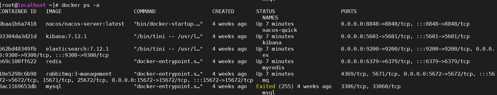
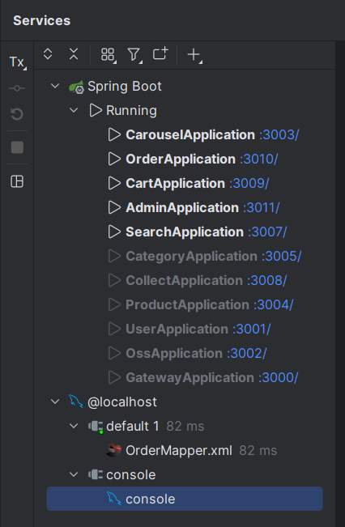
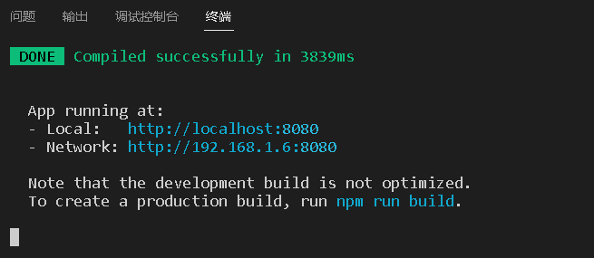

### 写在最前

本项目将Github上的项目进行简化

因个人精力有限,和设备条件限制去除了

日志,权限,会员,客户帮助,运营,统计,财务这6个模块

参考项目地址:https://github.com/macrozheng/mall

### 技术选型

后端技术

| 技术点              | 版本号        |
| ------------------- | ------------- |
| springboot          | 2.3.9.RELEASE |
| springcloud         | Hoxton.SR10   |
| springcloud alibaba | 2.2.5.RELEASE |
| spring cache        | 2.3.9.RELEASE |
| rabbitmq            | 5.9.0         |
| elasticsearch       | 7.12.1        |
| druid               | 1.2.5         |
| mybatis-plus        | 3.5.2         |
| lombok              | 1.18.24       |

前端技术

| 技术点     | 版本号  |
| ---------- | ------- |
| vue        | 2.6.10  |
| node       | 1.14.16 |
| element-ui | 2.13.0  |
| layui      | 2.9+    |
| axios      | 0.19.0  |
| vuex       | 3.1.2   |

### 开发工具

| 开发工具           | 版本号    | 备注                      |
| ------------------ | --------- | ------------------------- |
| jdk                | 1.8.0_65  | 8版本即可                 |
| idea               | 2022.2.3  | 随意                      |
| maven              | 3.8.6     | 3+即可                    |
| mysql              | 8.0.30    | 5.7+版本即可              |
| node               | 14.16.0   | 不建议高版本,18版本会报错 |
| nvm                | 1.1.0     | 管理node版本              |
| RedisDesktop       | 0.9.3.817 | 连接redis能用就行         |
| Navicat            | 16        | 连接数据库能用就行        |
| MobaXterm_chs      | 20        | 连接shell                 |
| VMware Workstation | 21        | 虚拟机                    |
|Apifox              |没找到版本号|接口测试|

### 组织结构

```text
mall
├── mall-commons -- 通用服务(parma,pojo,vo,utils)
├── mall-front-carousel -- 轮播图的服务
├── mall-front-cart -- 购物车服务
├── mall-front-category -- 商品类别服务
├── mall-front-collect -- 用户收藏商品服务
├── mall-front-order -- 订单服务
├── mall-front-user -- 用户服务
├── mall-gateway -- 网关服务
├── mall-search -- 搜索服务
└── mall-static-oss -- 静态资源
```

### 环境搭建:document中的环境搭建



### 后台服务搭建:document中的后台服务搭建



### 前台项目搭建::document中的前台项目搭建



> 因后台密码加盐处理,后台账号可自行添加

```sql
SELECT MD5('你的盐+密码')
```

> 自行更改即可

前台:http://localhost:8080

后台:http://localhost:3000/admin
