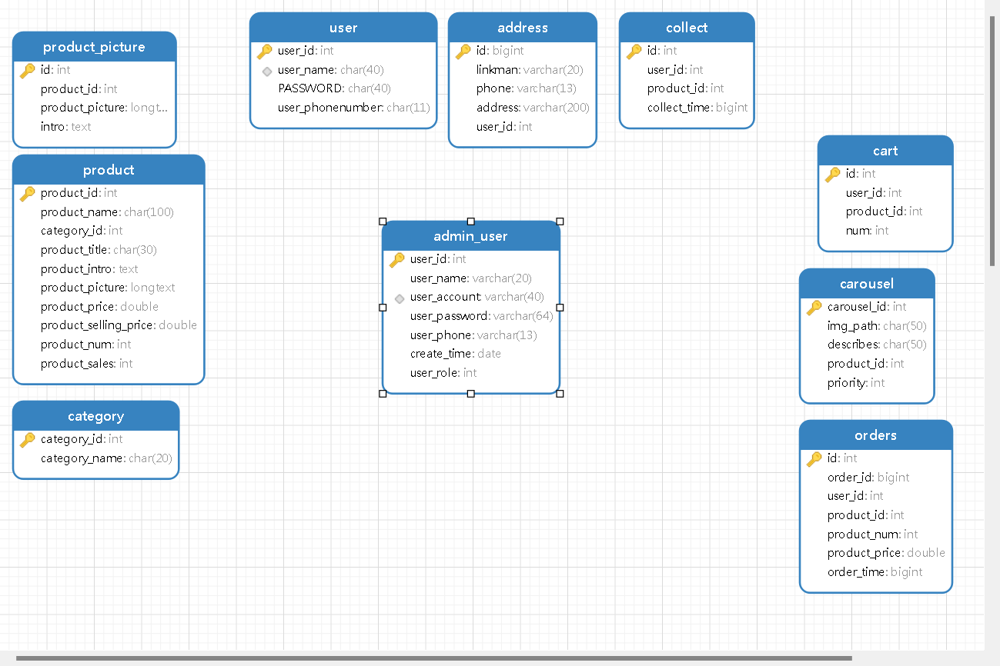

## 后台服务搭建

```text
JDK >= 1.8 (测试环境1.8版本) 
Mysql >= 5.7.25+ (测试环境8.0.30版本) 
Maven >= 3.0+ (测试环境3.8.6版本)
```

拉取代码

```sh
clone https://github.com/michelleclar/mall.git
```

执行sql文件

> 在document的sql中



将bootstrap中ip改成你nocos所在ip

application中redis,mysql等都改成你的ip

推荐快捷键

C+S+R //全局替换

192.168.2.5 ====> 你的ip

先启动gateway服务,search服务最后启动,其他服务没有顺序要求

